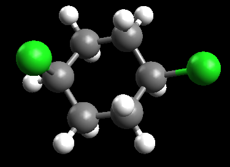

Conformations of a cyclohexane
==============================

The geometry optimsation procedures in QM software involve *local* optimisation of the energy, not *global* optimisation. This allows us to investigate energy differences between different conformations.

We are going to look at the difference in energy between conformations of 1,4-dichloro-cyclohexane.

Create an initial structure
---------------------------

Under Build/Insert/Fragment, choose share/avogadro/fragments/cyclic alkanes/cyclohexane.cml. Click :guilabel:`Insert Fragment`. Choose Edit/Select None to clear the selection.

.. note:: Which conformation of cyclohexane is this?

Choose the Draw Tool (|builder|), and change any hydrogen to a chlorine. Find the hydrogen atom on the opposite carbon that is on the same face of the ring, and change this also to chlorine.

Optimize the geometry using MMFF94.

.. note:: What parts of the structure change?

Generate conformations interactively
------------------------------------

Click on the Auto Optimization Tool (|autoopt|) and choose :guilabel:`Start` to turn it on. (Make sure that it is using the MMFF94 forcefield.)

Click on one of the chlorine atoms and drag it to change to another conformation.

.. note:: How many conformations of this cyclohexane can you find? 

  For each conformation:
  
  - use the Measure Tool (|measure|) to measure the chlorine-chlorine distance
  - use Extensions/Molecular Mechanics/Calculate Energy to find the MMFF94 energy
  - save each conformation to a CML file

Turn off the Auto Optimization by clicking :guilabel:`Stop`.

Calculate accurate energies
---------------------------

Open the saved conformations one-by-one, and generate input files for GAMESS for a geometry optimisation at the HF/3-21G level of theory.

Carry out the calculation for each conformation and note the energy.

.. note:: Is the same trend in energies observed for MMFF94 and HF/3-21G?

.. |builder| image:: _static/builder.png

